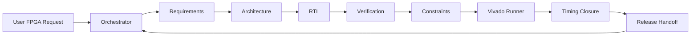

<div align="center">

# FPGA Multi-Agent Team

**An orchestrated AI workflow for Vivado-focused RTL development, verification, constraints, and timing closure.**


</div>

## Overview

FPGA Multi-Agent Team is a local skill for coordinating FPGA engineering work through specialized AI roles. It turns a hardware request into a staged workflow covering requirements, architecture, RTL, verification, constraints, Vivado checks, timing analysis, and release handoff.

The skill is designed around evidence-driven collaboration:

- each role has a clear responsibility;
- each handoff records inputs, outputs, assumptions, evidence, and risks;
- the Orchestrator arbitrates findings instead of hiding them;
- final reports distinguish verified results from residual engineering risk.

## Operating Model

```text
coordination_mode: orchestrated-agent-team
execution_mode: orchestrated-sequential-team
parallelism_claim: none
```



## Agent Roles

| Role | Responsibility | Typical Output |
| --- | --- | --- |
| Orchestrator | Scope the task, choose roles, set verification bar, arbitrate findings. | Agent plan, evidence ledger, final handoff |
| Requirements | Extract clocks, resets, interfaces, widths, throughput, CDC and hardware-changing unknowns. | Requirement table |
| Architecture | Define module boundaries, datapath, FSM, reset/CDC strategy and verification matrix. | Architecture plan |
| RTL | Implement or patch Vivado-friendly synthesizable RTL. | RTL changes and integration notes |
| Verification | Build self-checking tests, scoreboards, timeout guards and edge-case coverage. | Testbench strategy and PASS/FAIL criteria |
| Constraints | Review clocks, IO, generated clocks, CDC intent and justified timing exceptions. | XDC rationale |
| Vivado Runner | Select and report simulation, synthesis, implementation, CDC, timing and DRC checks. | Tool evidence |
| Timing Closure | Classify timing failures before proposing RTL or constraint fixes. | Root cause and fix plan |
| Release | Summarize ready artifacts, assumptions, checks not run and residual risks. | Engineering handoff |

## Install

Clone the repository:

```powershell
git clone https://github.com/makabaka165/fpga-multi-agent-team.git
cd fpga-multi-agent-team
```

Copy the skill folder into your local skills directory:

```powershell
Copy-Item -Recurse skill/fpga-multi-agent-team "$env:USERPROFILE\.codex\skills\fpga-multi-agent-team"
```

The installable skill folder is:

```text
skill/fpga-multi-agent-team/
  SKILL.md
  agents/openai.yaml
  references/
```

## Usage

Ask your agent to use the skill by name:

```text
Use the fpga-multi-agent-team skill to review this Verilog module.
Run the Requirements, Architecture, RTL, Verification, Constraints, Vivado Runner,
Timing Closure, and Release roles. Include an evidence ledger and residual risks.
```

For implementation work:

```text
Use fpga-multi-agent-team to implement this FPGA block.
Before writing RTL, produce requirements and architecture handoff packets.
After coding, produce a self-checking verification plan and Vivado check strategy.
```

For timing or constraint work:

```text
Use fpga-multi-agent-team to analyze these Vivado timing reports and XDC constraints.
Classify the timing paths before proposing any RTL or constraint changes.
```

## What The Skill Produces

For nontrivial FPGA tasks, the skill asks the agent to produce:

- a requirements table with hardware-changing assumptions;
- an architecture plan with clock/reset/CDC strategy;
- RTL, testbench or XDC changes when requested;
- a verification matrix and PASS/FAIL criteria;
- Vivado evidence or a clear statement of checks not run;
- an Orchestrator arbitration table when role findings conflict;
- a release handoff with residual risks and next checks.

## Repository Contents

```text
.
├── README.md
├── LICENSE
└── skill/
    └── fpga-multi-agent-team/
        ├── SKILL.md
        ├── agents/
        │   └── openai.yaml
        └── references/
            ├── multi-agent-fpga-team.md
            ├── multi-agent-evidence-protocol.md
            ├── vivado-rtl-guidelines.md
            ├── vivado-xdc-guidelines.md
            ├── timing-closure.md
            ├── testbench-patterns.md
            ├── rtl-patterns.md
            └── ...
```

## Design Boundaries

- This skill does not claim parallel execution by default.
- This skill does not replace Vivado, synthesis, implementation, timing reports, CDC reports or board-level signoff.
- Timing exceptions must be justified by hardware semantics, not used to suppress real problems.
- Board readiness requires real pin constraints, I/O standards, configuration voltage and external I/O timing.

## Validation

The skill folder has been checked with the standard skill validator:

```text
Skill is valid!
```

## License

MIT License. See [LICENSE](LICENSE).
