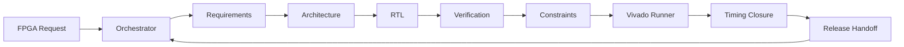

<p align="right">
  <strong>English</strong> | <a href="README.zh-CN.md">简体中文</a>
</p>

<div align="center">

# FPGA Multi-Agent Team

**An orchestrated AI hardware team for FPGA RTL development, verification, Vivado checks, and timing closure.**


</div>

## Overview

FPGA Multi-Agent Team is a local skill for coordinating FPGA engineering work through specialized AI roles. It is designed for projects where Verilog/SystemVerilog code, testbenches, XDC constraints, Vivado scripts, simulation, synthesis, implementation, CDC review, timing reports, and eventual board integration all need disciplined handoffs.

The motivation is simple: general LLMs can help with RTL, but FPGA work has sharp edges. A module can look plausible while still having CDC risk, unclear reset behavior, weak test coverage, unsafe timing exceptions, or claims that were never checked in Vivado. This skill turns that risk into an explicit workflow.

The skill extends the single-assistant FPGA workflow idea behind [verilog-fpga-assistant](https://github.com/makabaka165/verilog-fpga-assistant) into a coordinated AI team. Instead of asking one agent to do everything, it decomposes FPGA work into roles with owned evidence, handoff packets, and Orchestrator arbitration.

## Why Multi-Agent FPGA Work?

| FPGA concern | Dedicated role |
| --- | --- |
| Ambiguous clocks, resets, widths, interfaces, and board assumptions | Requirements Agent |
| Module boundaries, datapath, FSM, CDC and reset strategy | Architecture Agent |
| Synthesizable Verilog/SystemVerilog and integration notes | RTL Agent |
| Self-checking tests, scoreboards, timeouts, and edge cases | Verification Agent |
| XDC clocks, generated clocks, IO constraints, and timing exceptions | Constraints Agent |
| XSim/Vivado simulation, synthesis, implementation, CDC, DRC, timing reports | Vivado Runner Agent |
| WNS/WHS/TNS/THS root-cause classification before fixes | Timing Closure Agent |
| Final evidence, assumptions, residual risk, and next checks | Release Agent |

## Operating Model

```text
coordination_mode: orchestrated-agent-team
execution_mode: orchestrated-sequential-team
parallelism_claim: none
```



Parallel execution is not required. The default proof of multi-agent collaboration is explicit role specialization, scoped inputs, separate findings, handoff packets, evidence ownership, Orchestrator arbitration, and traceability from requirement to artifact to tool evidence.

## Install

Clone the repository:

```powershell
git clone https://github.com/makabaka165/fpga-multi-agent-team.git
cd fpga-multi-agent-team
```

Copy the skill folder into your local skills directory:

```powershell
Copy-Item -Recurse skill/fpga-multi-agent-team "$env:USERPROFILE\.codex\skills\fpga-multi-agent-team"
```

The installable skill folder is:

```text
skill/fpga-multi-agent-team/
  SKILL.md
  agents/openai.yaml
  references/
```

## Usage

Review an existing module:

```text
Use the fpga-multi-agent-team skill to review this Verilog module.
Run Requirements, Architecture, RTL, Verification, Constraints, Vivado Runner,
Timing Closure, and Release roles. Include an evidence ledger and residual risks.
```

Implement a new FPGA block:

```text
Use fpga-multi-agent-team to implement this FPGA block.
Before writing RTL, produce requirements and architecture handoff packets.
After coding, produce a self-checking verification plan and Vivado check strategy.
```

Analyze constraints and timing:

```text
Use fpga-multi-agent-team to analyze these Vivado timing reports and XDC constraints.
Classify timing paths before proposing any RTL or constraint changes.
```

## What The Skill Produces

For nontrivial FPGA tasks, the skill asks the agent to produce:

- a requirements table with hardware-changing assumptions;
- an architecture plan with clock/reset/CDC strategy;
- RTL, testbench, XDC, or script changes when requested;
- a verification matrix and PASS/FAIL criteria;
- Vivado/XSim evidence or a clear statement of checks not run;
- an Orchestrator arbitration table when role findings conflict;
- a traceability matrix linking requirement, artifact, tool evidence, and residual risk;
- a release handoff with integration notes and next checks.

## Repository Contents

```text
.
|-- README.md
|-- README.zh-CN.md
|-- LICENSE
`-- skill/
    `-- fpga-multi-agent-team/
        |-- SKILL.md
        |-- agents/
        |   `-- openai.yaml
        `-- references/
            |-- multi-agent-fpga-team.md
            |-- multi-agent-evidence-protocol.md
            |-- cdc-async-fifo-guidance.md
            |-- vivado-rtl-guidelines.md
            |-- rtl-style-guidelines.md
            |-- vivado-xdc-guidelines.md
            |-- timing-closure.md
            |-- testbench-patterns.md
            |-- rtl-patterns.md
            `-- ...
```

## Design Boundaries

- This skill does not replace simulation, synthesis, implementation, CDC reports, timing reports, DRC, methodology review, or board-level signoff.
- Timing exceptions must be justified by hardware semantics, not used to suppress real problems.
- Board readiness requires real pin constraints, IO standards, configuration voltage, external IO timing, and hardware validation when applicable.
- Vendor documentation should be consulted for exact Vivado behavior, XDC semantics, and device-specific details.

## Validation

The skill folder has been checked with the standard skill validator:

```text
Skill is valid!
```

## Related

- [verilog-fpga-assistant](https://github.com/makabaka165/verilog-fpga-assistant): a single-assistant Vivado-oriented FPGA RTL workflow skill. FPGA Multi-Agent Team builds on the same engineering concerns and adds role orchestration, evidence ownership, and Orchestrator arbitration.

## License

MIT License. See [LICENSE](LICENSE).
