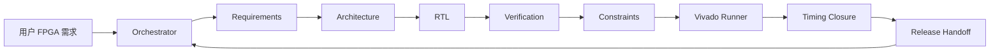

<p align="right">
  <a href="README.md">English</a> | <strong>简体中文</strong>
</p>

<div align="center">

# FPGA Multi-Agent Team

**面向 Vivado FPGA RTL 开发、验证、约束与时序收敛的多 Agent 编排式 skill。**


</div>

## 概览

FPGA Multi-Agent Team 是一个本地 skill，用于把 FPGA 工程任务组织成多个专业 AI 角色协同完成的流程。它将一个硬件需求拆解为需求分析、架构设计、RTL、验证、约束、Vivado 检查、时序分析和发布交接等阶段。

这个 skill 强调可审计的工程协作：

- 每个角色都有明确职责；
- 每次交接都记录输入、输出、假设、证据和风险；
- Orchestrator 负责仲裁发现，而不是掩盖问题；
- 最终报告会区分“已经验证的结论”和“仍需工程确认的风险”。

## 运行模式

```text
coordination_mode: orchestrated-agent-team
execution_mode: orchestrated-sequential-team
parallelism_claim: none
```



## Agent 角色

| Role | 职责 | 典型输出 |
| --- | --- | --- |
| Orchestrator | 定义任务范围、选择角色、设定验证门槛、仲裁发现。 | Agent 计划、证据总账、最终交付 |
| Requirements | 提取时钟、复位、接口、位宽、吞吐、CDC 和会改变硬件行为的未知项。 | 需求表 |
| Architecture | 定义模块边界、数据通路、状态机、reset/CDC 策略和验证矩阵。 | 架构方案 |
| RTL | 实现或修改 Vivado 友好的可综合 RTL。 | RTL 修改和集成说明 |
| Verification | 构建自检测试、scoreboard、超时保护和边界场景。 | 验证策略和 PASS/FAIL 标准 |
| Constraints | 审查时钟、IO、generated clocks、CDC 意图和合理的 timing exceptions。 | XDC 约束说明 |
| Vivado Runner | 选择并报告仿真、综合、实现、CDC、时序和 DRC 检查。 | 工具证据 |
| Timing Closure | 先分类时序失败原因，再提出 RTL 或约束修改。 | 根因和修复计划 |
| Release | 汇总可交付产物、假设、未运行检查和残留风险。 | 工程交接摘要 |

## 安装

克隆仓库：

```powershell
git clone https://github.com/makabaka165/fpga-multi-agent-team.git
cd fpga-multi-agent-team
```

把 skill 目录复制到本地 skills 目录：

```powershell
Copy-Item -Recurse skill/fpga-multi-agent-team "$env:USERPROFILE\.codex\skills\fpga-multi-agent-team"
```

可安装的 skill 目录结构如下：

```text
skill/fpga-multi-agent-team/
  SKILL.md
  agents/openai.yaml
  references/
```

## 使用方式

在对话中直接点名使用这个 skill：

```text
Use the fpga-multi-agent-team skill to review this Verilog module.
Run the Requirements, Architecture, RTL, Verification, Constraints, Vivado Runner,
Timing Closure, and Release roles. Include an evidence ledger and residual risks.
```

用于实现任务：

```text
Use fpga-multi-agent-team to implement this FPGA block.
Before writing RTL, produce requirements and architecture handoff packets.
After coding, produce a self-checking verification plan and Vivado check strategy.
```

用于时序或约束分析：

```text
Use fpga-multi-agent-team to analyze these Vivado timing reports and XDC constraints.
Classify the timing paths before proposing any RTL or constraint changes.
```

## Skill 会产出什么

对于非平凡 FPGA 任务，这个 skill 会要求 Agent 输出：

- 包含硬件关键假设的需求表；
- 包含 clock/reset/CDC 策略的架构方案；
- 按需求生成或修改 RTL、testbench、XDC；
- 验证矩阵和 PASS/FAIL 标准；
- Vivado 工具证据，或明确说明哪些检查没有运行；
- 当角色发现冲突时，给出 Orchestrator 仲裁表；
- 包含残留风险和下一步检查的 release handoff。

## 仓库内容

```text
.
├── README.md
├── README.zh-CN.md
├── LICENSE
└── skill/
    └── fpga-multi-agent-team/
        ├── SKILL.md
        ├── agents/
        │   └── openai.yaml
        └── references/
            ├── multi-agent-fpga-team.md
            ├── multi-agent-evidence-protocol.md
            ├── vivado-rtl-guidelines.md
            ├── vivado-xdc-guidelines.md
            ├── timing-closure.md
            ├── testbench-patterns.md
            ├── rtl-patterns.md
            └── ...
```

## 设计边界

- 默认不声明并行执行。
- 这个 skill 不替代 Vivado、综合、实现、时序报告、CDC 报告或板级 signoff。
- timing exception 必须有硬件语义依据，不能用来掩盖真实问题。
- 板级就绪需要真实 pin constraints、I/O standards、configuration voltage 和 external I/O timing。

## 校验

当前 skill 目录已通过标准 skill 校验：

```text
Skill is valid!
```

## License

MIT License. See [LICENSE](LICENSE).

MIT 是一种宽松的开源许可证。简单说，别人可以使用、复制、修改、合并、发布、分发、再授权，甚至出售这个项目的副本，但需要保留原始版权声明和许可证声明。同时，软件按“原样”提供，不提供担保。
