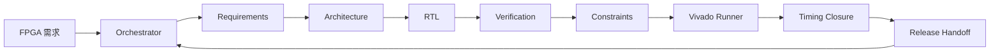

<p align="right">
  <a href="README.md">English</a> | <strong>简体中文</strong>
</p>

<div align="center">

# FPGA Multi-Agent Team

**面向 FPGA RTL 开发、验证、Vivado 检查与时序收敛的多 Agent 硬件工程团队 Skill。**


</div>

## 概览

FPGA Multi-Agent Team 是一个本地 Skill，用于把 FPGA 工程任务组织成多个专业 AI 角色协同完成的流程。它适合 Verilog/SystemVerilog 编写、testbench、XDC 约束、Vivado 脚本、仿真、综合、实现、CDC 审查、时序报告分析以及后续板级集成等场景。

这个 Skill 的出发点很直接：通用 LLM 可以帮助写 RTL，但 FPGA 工程有很多边界。代码看起来像 Verilog，不代表 CDC 安全、复位清楚、testbench 自检充分、timing exception 合理，也不代表 Vivado 已经验证过。这个 Skill 把这些风险转化为明确的工程流程。

它延续了单助手 FPGA 工作流 [verilog-fpga-assistant](https://github.com/makabaka165/verilog-fpga-assistant) 的思路，并进一步扩展成多 Agent 团队：不是让一个 Agent 做所有事情，而是把 FPGA 开发拆成多个角色，每个角色有自己的输入边界、输出证据、交接包和 Orchestrator 仲裁。

## 为什么 FPGA 需要多 Agent？

| FPGA 问题 | 对应角色 |
| --- | --- |
| 时钟、复位、位宽、接口、板卡假设不清 | Requirements Agent |
| 模块边界、数据通路、FSM、CDC 和 reset 策略 | Architecture Agent |
| 可综合 Verilog/SystemVerilog 与集成说明 | RTL Agent |
| 自检 testbench、scoreboard、timeout 和边界场景 | Verification Agent |
| XDC 主时钟、派生时钟、IO 约束和 timing exception | Constraints Agent |
| XSim/Vivado 仿真、综合、实现、CDC、DRC、timing 报告 | Vivado Runner Agent |
| WNS/WHS/TNS/THS 时序根因分类 | Timing Closure Agent |
| 最终证据、假设、残留风险和下一步检查 | Release Agent |

## 运行模式

```text
coordination_mode: orchestrated-agent-team
execution_mode: orchestrated-sequential-team
parallelism_claim: none
```



默认不声明并行执行。这里的“多 Agent”证明来自明确的角色分工、隔离输入、独立发现、交接包、证据归属、Orchestrator 仲裁，以及从需求到产物再到工具证据的 traceability。

## 安装

克隆仓库：

```powershell
git clone https://github.com/makabaka165/fpga-multi-agent-team.git
cd fpga-multi-agent-team
```

复制 skill 文件夹到本地 skills 目录：

```powershell
Copy-Item -Recurse skill/fpga-multi-agent-team "$env:USERPROFILE\.codex\skills\fpga-multi-agent-team"
```

可安装的 skill 目录结构：

```text
skill/fpga-multi-agent-team/
  SKILL.md
  agents/openai.yaml
  references/
```

## 使用示例

审查已有模块：

```text
Use the fpga-multi-agent-team skill to review this Verilog module.
Run Requirements, Architecture, RTL, Verification, Constraints, Vivado Runner,
Timing Closure, and Release roles. Include an evidence ledger and residual risks.
```

实现新的 FPGA 模块：

```text
Use fpga-multi-agent-team to implement this FPGA block.
Before writing RTL, produce requirements and architecture handoff packets.
After coding, produce a self-checking verification plan and Vivado check strategy.
```

分析约束和时序：

```text
Use fpga-multi-agent-team to analyze these Vivado timing reports and XDC constraints.
Classify timing paths before proposing any RTL or constraint changes.
```

## Skill 会产出什么？

对于非平凡 FPGA 任务，这个 Skill 会引导 Agent 输出：

- 带硬件关键假设的需求表；
- 包含 clock/reset/CDC 策略的架构方案；
- 按需生成或修改 RTL、testbench、XDC 或脚本；
- 验证矩阵和 PASS/FAIL 标准；
- Vivado/XSim 工具证据，或明确说明哪些检查没有运行；
- 当角色发现冲突时，给出 Orchestrator 仲裁表；
- 将需求、产物、工具证据和残留风险关联起来的 Traceability Matrix；
- 包含集成说明和下一步检查的 release handoff。

## 仓库内容

```text
.
|-- README.md
|-- README.zh-CN.md
|-- LICENSE
`-- skill/
    `-- fpga-multi-agent-team/
        |-- SKILL.md
        |-- agents/
        |   `-- openai.yaml
        `-- references/
            |-- multi-agent-fpga-team.md
            |-- multi-agent-evidence-protocol.md
            |-- cdc-async-fifo-guidance.md
            |-- vivado-rtl-guidelines.md
            |-- rtl-style-guidelines.md
            |-- vivado-xdc-guidelines.md
            |-- timing-closure.md
            |-- testbench-patterns.md
            |-- rtl-patterns.md
            `-- ...
```

## 设计边界

- 这个 Skill 不能替代仿真、综合、实现、CDC 报告、时序报告、DRC、Methodology 审查或板级 signoff。
- timing exception 必须有硬件语义依据，不能用来掩盖真实问题。
- 板级就绪仍然需要真实 pin 约束、IOSTANDARD、configuration voltage、external IO timing，以及必要的硬件验证。
- Vivado 精确行为、XDC 语义和器件细节应以对应厂商文档为准。

## 校验

当前 skill 目录已通过标准 skill 校验：

```text
Skill is valid!
```

## 相关项目

- [verilog-fpga-assistant](https://github.com/makabaka165/verilog-fpga-assistant)：单助手形态的 Vivado-oriented FPGA RTL 工作流 Skill。FPGA Multi-Agent Team 在相同工程边界基础上增加了角色编排、证据归属和 Orchestrator 仲裁。

## License

MIT License. See [LICENSE](LICENSE).
